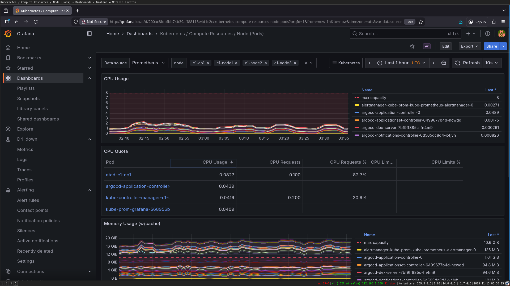
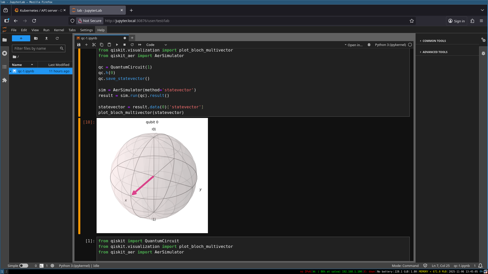

# Kubernetes Homelab for CKA preparation
Includes infrastructure provisioning with Terraform, Kubernetes setup with kubeadm, GitOps with ArgoCD, monitoring with Prometheus and Grafana and LLM endpoint with FastAPI.

---
# Overview

The setup uses **Terraform** to create and configure four KVM virtual machines:
- **Control Plane:** `c1-cp1` (5 GB RAM)
- **Worker Nodes:** `c1-node1`, `c1-node2`, `c1-node3` (3 GB RAM each)

# Infrastructure Layout

| VM Name     | Role          | IP Address       | RAM  | Disk Image Path |
|--------------|----------------|------------------|------|------------------|
| `c1-cp1`     | Control Plane  | `192.168.122.5`  | 5 GB | `/var/lib/libvirt/images/c1-cp1.qcow2` |
| `c1-node1`   | Worker Node    | `192.168.122.10` | 3 GB | `/var/lib/libvirt/images/c1-node1.qcow2` |
| `c1-node2`   | Worker Node    | `192.168.122.12` | 3 GB | `/var/lib/libvirt/images/c1-node2.qcow2` |
| `c1-node3`   | Worker Node    | `192.168.122.13` | 3 GB | `/var/lib/libvirt/images/c1-node3.qcow2` |

Once provisioned, Kubernetes is installed and configured with:

**Argo CD** - GitOps continuous delivery  
**MetalLB** - LoadBalancer for bare-metal IP allocation  
**Prometheus & Grafana** - Monitoring and visualization  
**JupyterHub** - Multi-user data science environment  
**FastAPI + LLM Sentiment Endpoint (pending)** - Example AI service deployed via Argo CD  
**Kubeflow (pending)** - Automate AI workflows

# **Kubernetes Stack**

| Component | Description |
|------------|--------------|
| **Argo CD** | Manages deployments declaratively |
| **MetalLB** | Provides LoadBalancer IPs in the local network |
| **Prometheus** | Collects metrics from Kubernetes components |
| **Grafana** | Visualizes metrics and dashboards |
| **JupyterHub** | Multi-user notebook environment |
| **FastAPI LLM Endpoint** | Simple sentiment analysis API backed by a local LLM model |

# Access Endpoints

| Service | Endpoint | Description |
|----------|-----------|-------------|
| **Argo CD** | `https://argocd.local` | GitOps continuous delivery dashboard |
| **Grafana** | `http://grafana.local` | Metrics visualization and dashboards |
| **Prometheus** | `http://prometheus.local` | Metrics collection and queries |
| **JupyterHub** | `http://jupyter.local` | Multi-user notebook environment |
| **FastAPI Sentiment LLM** | `http://llm.local/sentiment` | REST API for sentiment analysis |
| **Kubernetes Dashboard** | `http://dashboard.local` | Web UI for cluster management |

> *Domains are resolved via MetalLB-assigned LoadBalancer IPs.  
Add entries to `/etc/hosts` for local access.*

---

# Screenshots

### ArgoCD

### Grafana

### JupyterHub

