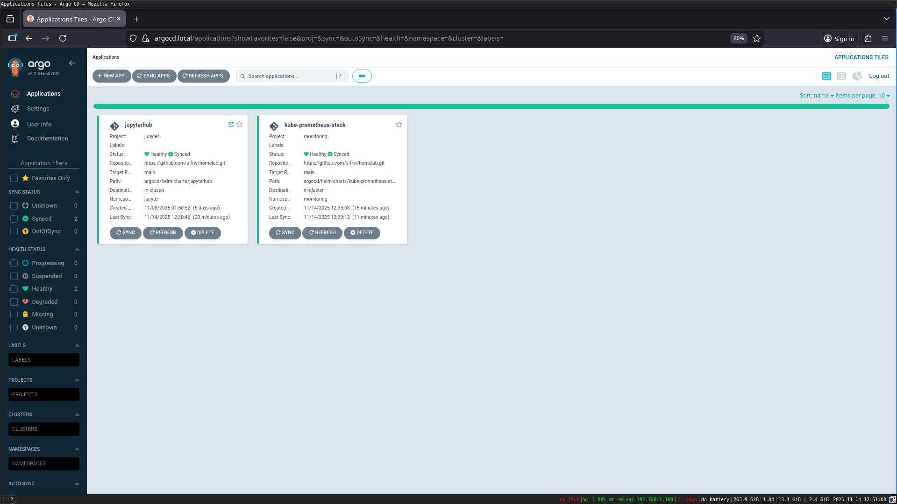
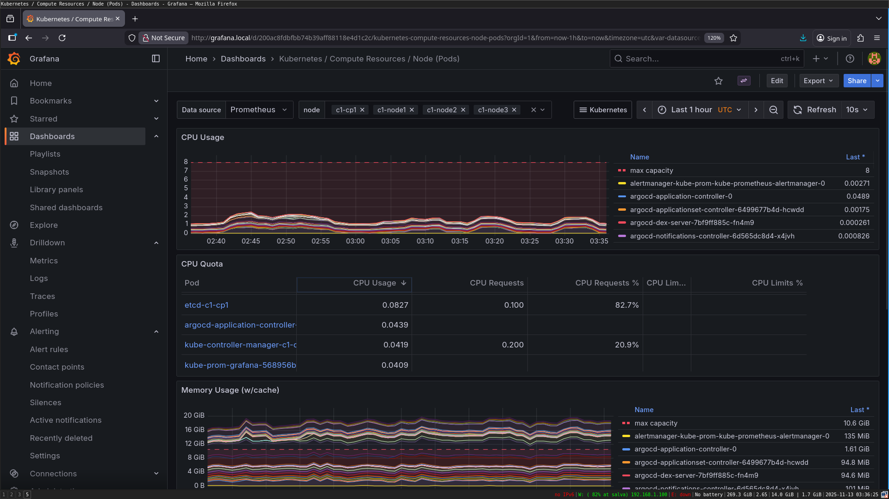
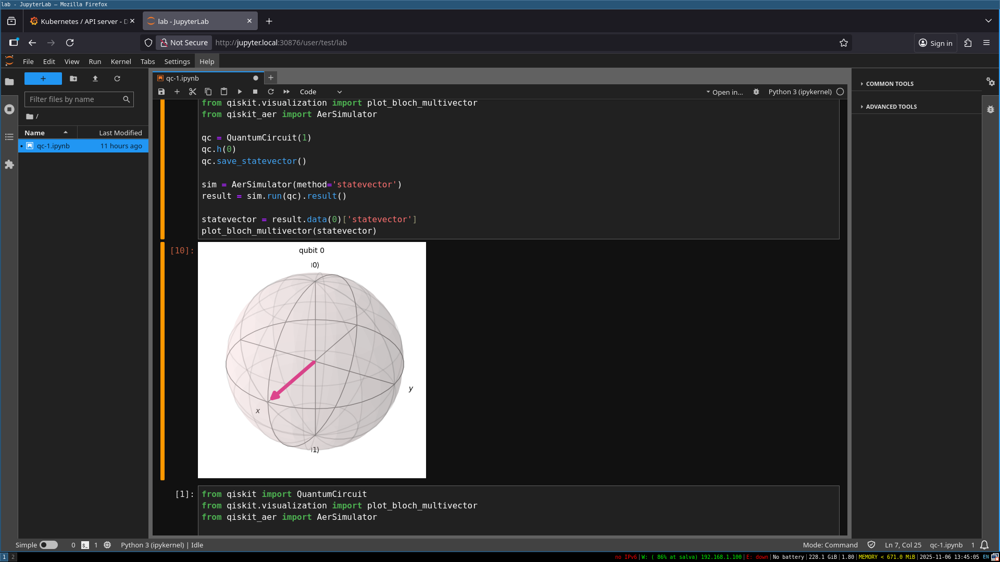

# Kubernetes Homelab

> [!NOTE]
> Previous homelab environment, kept for reference.

4 KVM VMs provisioned with Terraform, Kubernetes installed with kubeadm.

## VMs

| Name | Role | IP | RAM |
|------|------|-----|-----|
| c1-cp1 | Control plane | 192.168.122.5 | 5 GB |
| c1-node1 | Worker | 192.168.122.10 | 3 GB |
| c1-node2 | Worker | 192.168.122.12 | 3 GB |
| c1-node3 | Worker | 192.168.122.13 | 3 GB |

## Deployed on the cluster

- Argo CD - GitOps
- MetalLB - LoadBalancer IPs on bare metal
- Prometheus / Grafana - monitoring
- JupyterHub - notebook environment

## Access

| Service | Endpoint |
|---------|----------|
| Argo CD | https://argocd.local |
| Grafana | http://grafana.local |
| Prometheus | http://prometheus.local |
| JupyterHub | http://jupyter.local |
| Kubernetes Dashboard | http://dashboard.local |

Domains resolve to MetalLB LoadBalancer IPs - add entries to `/etc/hosts`.

## Screenshots

